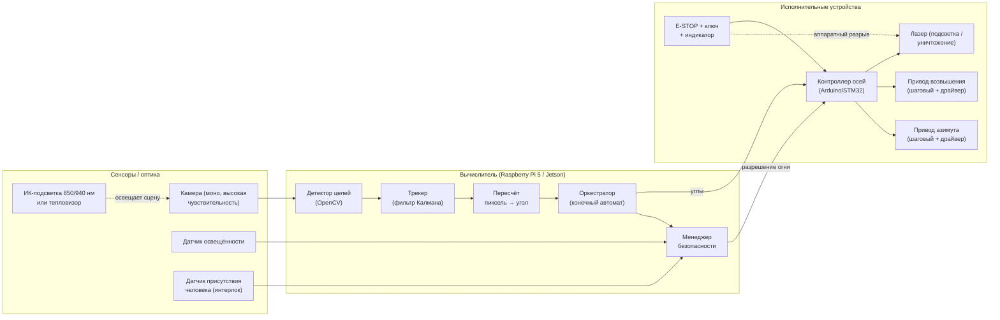
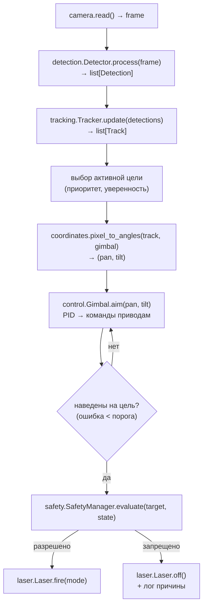
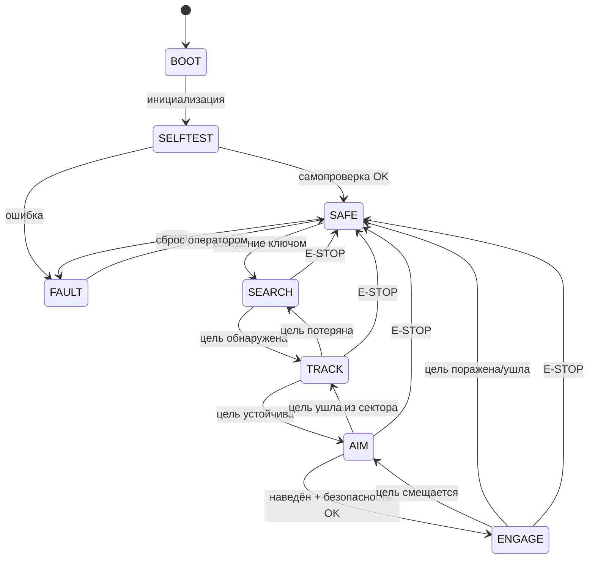

# Архитектура системы

## 1. Общая структурная схема

## 2. Программные модули и потоки данных

## 3. Конечный автомат оркестратора

## 4. Разделение ответственности (контроллер осей vs вычислитель)

| Функция | Где выполняется | Почему |
|---------|-----------------|--------|
| Компьютерное зрение, трекинг | Вычислитель (Python) | Требует вычислительной мощности |
| Пересчёт координат, стратегия | Вычислитель (Python) | Гибкость, логирование |
| Замкнутый контур приводов | Контроллер осей (C/прошивка) | Детерминизм, реальное время |
| Аппаратные блокировки, E-STOP | Контроллер осей + аппаратно | Безопасность не должна зависеть от ОС |
| Индикация излучения | Аппаратно | Требование норм безопасности |

Вычислитель шлёт контроллеру целевые углы и запросы огня по последовательному
порту (протокол — см. [electronics.md](electronics.md#протокол-обмена)); контроллер
отвечает телеметрией и **вправе отклонить** небезопасную команду.

## 5. Временной бюджет (цель — 30 кадров/с)

| Этап | Бюджет, мс |
|------|-----------|
| Захват кадра | 5 |
| Детектор (вычитание фона, контуры) | 10 |
| Трекер (Калман, ассоциация) | 2 |
| Пересчёт координат + стратегия | 1 |
| Отправка команд, телеметрия | 2 |
| Резерв | 13 |
| **Итого** | **≤ 33 мс** |
