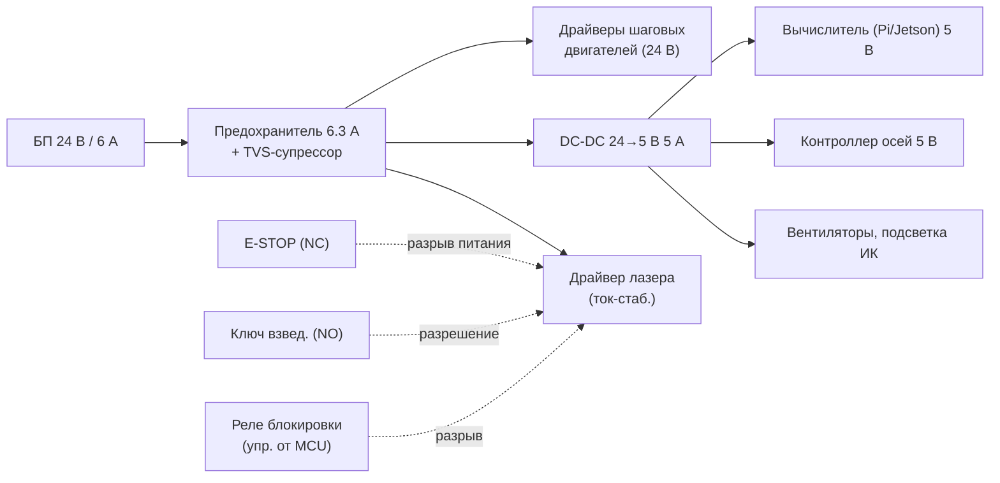
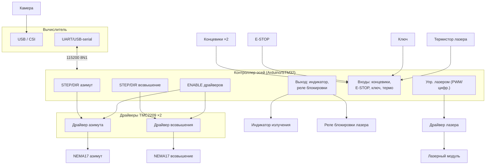

# Электрическая схема, разводка и питание

> Все цепи лазера должны иметь аппаратный разрыв через E-STOP, независимый от ПО.
> См. [../SAFETY.md](../SAFETY.md).

## 1. Блок-схема питания



Питание лазера проходит последовательно через **три** размыкающих элемента:
аварийный стоп (нормально-замкнутый), ключ взведения и управляемое реле
блокировки от контроллера. Разрыв любого гасит лазер физически.

## 2. Схема соединений (разводка сигналов)



## 3. Назначение выводов контроллера (пример для Arttino/STM32)

| Сигнал | Вывод (пример) | Тип | Назначение |
|--------|----------------|-----|------------|
| PAN_STEP | D2 | выход | Шаг привода азимута |
| PAN_DIR | D3 | выход | Направление азимута |
| TILT_STEP | D4 | выход | Шаг привода возвышения |
| TILT_DIR | D5 | выход | Направление возвышения |
| DRV_ENABLE | D6 | выход | Разрешение драйверов (актив. низкий) |
| LASER_PWM | D9 | выход (PWM) | Управление мощностью лазера |
| LASER_RELAY | D8 | выход | Реле блокировки питания лазера |
| EMIT_LED | D7 | выход | Индикатор излучения |
| ESTOP_IN | D10 | вход (pullup) | Кнопка аварийного останова (NC) |
| ARM_KEY_IN | D11 | вход (pullup) | Ключ взведения |
| LIMIT_PAN | D12 | вход (pullup) | Концевик азимута |
| LIMIT_TILT | D13 | вход (pullup) | Концевик возвышения |
| LASER_TEMP | A0 | вход (ADC) | Термистор лазера |
| HOST_UART | RX/TX | UART | Связь с вычислителем |

## 4. Протокол обмена (вычислитель ⇄ контроллер осей)

Текстовый строчный протокол, 115200 8N1, окончание строки `\n`.
Каждая команда подтверждается контроллером; контроллер вправе отклонить.

**Команды от вычислителя → контроллеру:**

| Команда | Формат | Описание |
|---------|--------|----------|
| Взвести | `ARM` | Перейти в ARMED (если ключ вставлен) |
| Разоружить | `DISARM` | Вернуться в SAFE |
| Навести | `AIM <pan_deg> <tilt_deg>` | Задать целевые углы |
| Огонь | `FIRE <mode> <power_pct> <ms>` | `mode`=MARK\|KILL |
| Стоп огня | `HOLD` | Погасить лазер |
| Хоуминг | `HOME` | Выход на концевики, обнуление |
| Пинг | `PING` | Сброс watchdog |

**Телеметрия контроллер → вычислителю:**

```
STATE <state> PAN <deg> TILT <deg> LASER <on|off> ESTOP <0|1> KEY <0|1> TEMP <c>
```

Контроллер **самостоятельно** гасит лазер при: нажатом E-STOP, вынутом ключе,
пропаже пинга дольше `watchdog_timeout`, перегреве, срабатывании концевика.

## 5. Спецификация комплектующих

См. [bom.csv](bom.csv).
