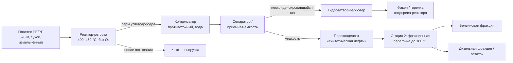

# Мини-установка пиролиза пластика в жидкое топливо

> ⚠️ **Это учебно-инженерный обзор, а не сертифицированный чертёж.**
> Пиролиз — это работа с горючими газами и температурами 400–500 °C.
> Ошибка в конструкции может привести к пожару или взрыву. Собирать и
> запускать такую установку можно только на открытом воздухе, вдали от
> построек, с огнетушителем под рукой и пониманием каждого узла.
> Производство топлива в вашей юрисдикции может требовать разрешений —
> проверьте местное законодательство до начала работ.

---

## Состав пакета документации

| Файл | Содержание |
|---|---|
| **DESIGN.md** (этот файл) | Процесс, конструкция, параметры, безопасность |
| [schematic.svg](schematic.svg) | Принципиальная схема установки |
| [ASSEMBLY.md](ASSEMBLY.md) | Пошаговая инструкция сборки в 8 этапов |
| [controller/WIRING.md](controller/WIRING.md) | Электрическая схема, fail-safe силовая цепь |
| [controller/pyrolysis_controller.ino](controller/pyrolysis_controller.ino) | Прошивка ESP32: PID + аварийные блокировки |
| [ai/analyze_run.py](ai/analyze_run.py) | ИИ-анализ телеметрии прогонов (Claude API) |

Роль ИИ в проекте: **аварийная защита — только детерминированная**
(механический клапан, гидрозатвор, жёсткие пороги в контроллере).
ИИ работает уровнем выше — разбирает телеметрию прогонов и даёт
рекомендации по настройке процесса.

---

## 1. Что реально получается из пластика

Пиролиз — это термическое разложение полимера **без доступа кислорода**.
Длинные молекулы полиэтилена и полипропилена рвутся на короткие
углеводороды, которые конденсируются в жидкость.

**Важно понимать:** на выходе получается не бензин, а **пиролизная
жидкость** («синтетическая нефть») — смесь углеводородов от лёгких
бензиновых до тяжёлых мазутных фракций. Чтобы выделить бензиновую
фракцию, нужна вторая стадия — **фракционная перегонка**.

Типичный баланс продуктов при пиролизе PE/PP (медленный пиролиз, 400–450 °C):

| Продукт | Доля по массе | Что это |
|---|---|---|
| Жидкость (пироконденсат) | 60–80 % | Смесь бензиновых, керосиновых, дизельных фракций |
| Неконденсируемый газ | 10–20 % | Метан, этан, пропилен и др. — сжигается в горелке установки |
| Твёрдый остаток (кокс) | 5–15 % | Уголь + минеральные наполнители пластика |

Из жидкости после перегонки бензиновая фракция (до ~180 °C) составляет
примерно 30–50 %.

**Качество топлива — честно:**
- Октановое число низкое (~60–80), много олефинов, топливо нестабильно
  при хранении (мутнеет, смолится).
- В современный инжекторный двигатель без гидроочистки и присадок лить
  нельзя. Реалистичные применения: печи и горелки на жидком топливе,
  дизельная фракция — в старую неприхотливую технику, и то с оговорками.
- Проект Precious Plastic (крупнейшее open-source сообщество по
  переработке пластика) осознанно **отказался** от пиролиза для
  любителей из-за рисков безопасности и токсичности. Это стоит знать,
  принимая решение.

## 2. Какой пластик подходит

| Код | Пластик | Пригодность |
|---|---|---|
| 2, 4 (HDPE, LDPE) | Полиэтилен | ✅ Лучшее сырьё, высокий выход жидкости |
| 5 (PP) | Полипропилен | ✅ Отличное сырьё |
| 6 (PS) | Полистирол | ✅ Даёт много жидкости (стирол-ароматика), но топливо хуже |
| 1 (PET) | Бутылки | ❌ Почти не даёт масла, забивает систему терефталевой кислотой |
| 3 (PVC) | ПВХ | ⛔ **Категорически нельзя.** Выделяет хлороводород (HCl): токсично, разъедает установку, в продуктах — хлорорганика |
| 7 (Other), ABS, PU | Разное | ❌ Непредсказуемо, часто токсичные продукты (PU → цианиды) |

Сырьё должно быть **сухим и чистым** — вода в реакторе даёт резкие
выбросы пара, грязь увеличивает кокс.

## 3. Схема процесса

## 4. Конструкция мини-установки (загрузка 3–5 кг)

### 4.1. Реактор
- Стальная ёмкость 10–20 л с толщиной стенки от 3 мм. Классическое
  донорское изделие — старый пропановый баллон (перед резкой —
  **полностью** дегазировать: заполнить водой). Алюминий и тонкая
  нержавейка от бочек не подходят.
- Съёмная крышка на болтах с графитовой или медной прокладкой
  (резина не держит температуру).
- Выход паров — труба ¾"–1" из верхней точки. Труба должна идти с
  подъёмом или коротким горизонтальным участком, чтобы тяжёлые фракции
  стекали обратно в реактор (простейший рефлюкс — повышает качество
  жидкости).
- **Обязательно:** предохранительный клапан или разрывная мембрана.
  Герметичный сосуд с нагревом и без аварийного сброса — это бомба.

### 4.2. Нагрев и контроль
- Дровяная/газовая горелка снизу или электрический ленточный нагреватель
  2–3 кВт вокруг корпуса + слой минеральной ваты (каменная вата,
  выдерживает 600+ °C).
- Термопара типа K в гильзе внутрь реактора (не на стенку — стенка
  горячее содержимого на 50–100 °C) + PID-контроллер (REX-C100 и
  аналоги) с твердотельным реле, если нагрев электрический.
- Рабочий режим: медленный нагрев ~5 °C/мин до 400–450 °C, выдержка до
  прекращения выхода конденсата (2–4 часа на загрузку). Выше 500 °C
  растёт доля газа и падает выход жидкости.

### 4.3. Конденсатор
- Противоточный «труба в трубе»: внутренняя труба ¾"–1" (по ней пары),
  наружная рубашка с проточной водой. Длина 1–1,5 м, наклон вниз к
  приёмнику.
- Медь или сталь; паяные/сварные соединения, не резьба на герметике.
- Расчёт грубый: на 1 кг/ч паров достаточно ~0,5 м² поверхности
  теплообмена при проточной воде 15–20 °C.

### 4.4. Приёмник и газовый тракт
- Приёмная ёмкость (стеклянная бутыль/стальная канистра) с двумя
  штуцерами: вход конденсата, выход остаточного газа.
- Дальше газ — через **гидрозатвор-барботёр** (банка с водой, трубка
  под уровень воды на 5–10 см). Гидрозатвор выполняет две функции:
  обратный клапан против проскока пламени в систему и визуальный
  индикатор расхода газа.
- Несконденсировавшийся газ **нельзя выпускать в атмосферу** — он
  горюч и вонюч. Правильно: сжигать на факеле или подавать в горелку
  подогрева реактора (самоподдерживающийся процесс, так делают
  промышленные установки).

### 4.5. Инертизация — критичный пункт
Перед нагревом в системе воздух. Смесь углеводородных паров с воздухом
внутри установки взрывоопасна. Варианты:
- продуть систему азотом или CO₂ (огнетушитель) перед пуском;
- либо жёстко следить, чтобы в системе не было точек, где пары могут
  смешаться с воздухом и встретить источник зажигания, а первые
  «грязные» газы (пока вытесняется воздух) сразу уводить на факел.
Продувка инертом — единственный по-настоящему правильный вариант.

## 5. Ориентировочная спецификация (BOM)

| # | Узел | Пример исполнения | Оценка |
|---|---|---|---|
| 1 | Корпус реактора | Пропановый баллон 27 л, дегазированный | б/у |
| 2 | Крышка, фланец, болты М10, прокладка графит | стальной лист 4 мм | — |
| 3 | Труба паровая ¾", отводы | сталь | — |
| 4 | Предохранительный клапан 2–3 бар | стандартный, для компрессора не подходит — нужен температуростойкий | важно |
| 5 | Конденсатор «труба в трубе» 1,2 м | медь/сталь + рубашка | — |
| 6 | Приёмник 5–10 л | стальная канистра | — |
| 7 | Гидрозатвор | стеклобанка + трубки | — |
| 8 | Термопара K + PID + SSR-40 | REX-C100 комплект | ~$20 |
| 9 | Нагреватель ленточный 2–3 кВт или газовая горелка | — | — |
| 10 | Изоляция: каменная вата + оцинковка | 50 мм | — |
| 11 | Баллон CO₂/азот для продувки | — | обязательно |
| 12 | Огнетушитель порошковый от 5 кг | — | обязательно |

## 6. Стадия 2: перегонка на бензиновую фракцию

Пироконденсат перегоняют в простейшей дистилляционной колонне
(куб + насадочная колонна + дефлегматор):
- фракция до **~180 °C** — бензиновая (лигроиновая);
- 180–360 °C — дизельная;
- остаток — мазут/парафины (можно возвращать в пиролиз).

Даже после перегонки бензиновая фракция — низкооктановая и
нестабильная. Для реального использования в бензиновых двигателях
требуется гидроочистка и присадки, что вне досягаемости мини-установки.
Практичная цель мини-установки — **печное/горелочное топливо** и
дизельная фракция, а не автомобильный бензин.

## 7. Правила безопасности (минимум)

1. Только на открытом воздухе, ≥10 м от построек и горючих материалов.
2. Никогда не оставлять работающую установку без присмотра.
3. Никакого ПВХ и полиуретана в загрузке — токсичные газы.
4. Предохранительный клапан — не опция. Проверять перед каждым пуском.
5. Продувка инертным газом перед нагревом.
6. Не открывать реактор до остывания ниже 100 °C: кокс на воздухе при
   300+ °C самовоспламеняется.
7. Пироконденсат хранить как бензин: металлическая тара, вдали от огня,
   не в жилых помещениях. Пары токсичны.
8. Огнетушитель и план эвакуации до первого пуска, а не после.

## 8. Юридическая сторона

Производство и хранение моторного топлива в большинстве стран
регулируется (акцизы, экологические и пожарные нормы). Для личного
эксперимента с сотнями граммов это обычно вопрос пожарных норм, для
регулярного производства — уже лицензируемая деятельность. Проверьте
законодательство своей страны до постройки.

## 9. С чего начать

1. Изучить готовые решения: промышленные мини-установки (например,
   Biofabrik WASTX, китайские реакторы 100 кг/сутки) и открытые
   публикации по пиролизу полиолефинов — по запросу
   *"plastic pyrolysis plant design"* много академических статей с
   параметрами процессов.
2. Собрать и отладить **холодную модель**: реактор + конденсатор +
   гидрозатвор на воде/паре, проверить герметичность давлением воздуха
   0,5 бар с мыльным раствором.
3. Первый горячий пуск — минимальная загрузка 200–300 г чистого PP,
   только для проверки тракта.
4. Только после этого выходить на рабочие загрузки.
